HandWritten Character Segmentation from paragraphs into individual letters

<h2>Dependencies:-</h2>
<ul>
<li>OpenCV-3.1.0</li>
<li>Pyhton3</li>
<li>NumPy</li>
</ul>

Directory <b>segmented_img</b> contains the individual characters of input 
image.

Sorry, I didn't had much time to make this programe easy to use. There are 
many hard thresholds and input image have to set in the code itself.

<h2>Example</h2>

Input Image
e

In between processing:

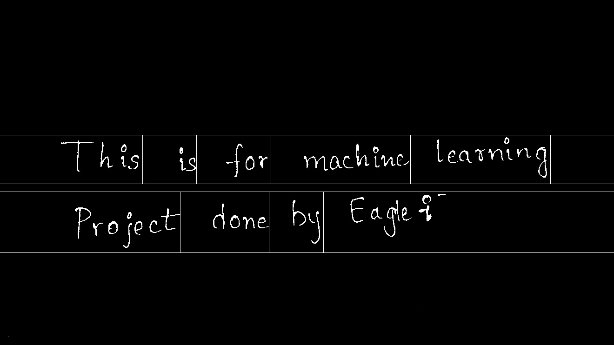
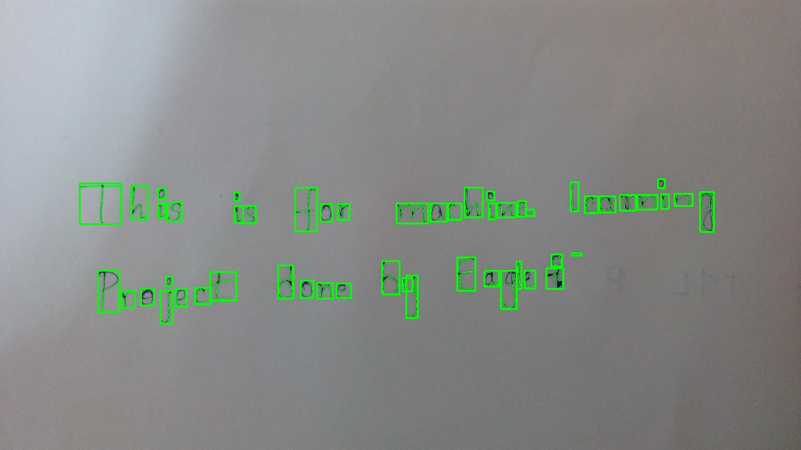

Final Output: Here we get single image corresponding to each letter in the text.

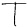
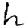
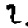
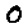
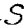
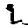

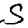
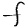
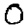
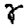
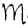
